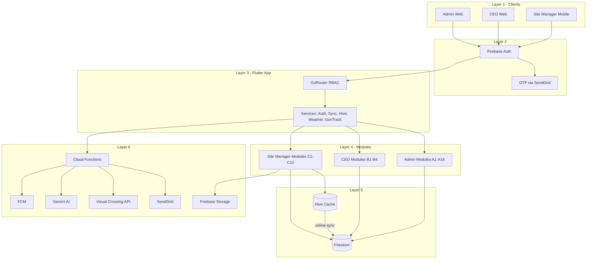

# CEO Construction Monitoring System — System Architecture

> **Purpose:** Accurate architecture reference for documentation, defense, and diagram generation.  
> **Stack:** Flutter (single codebase: Web + Mobile) · Firebase (Auth, Firestore, Storage, Functions, FCM) · Hive (offline cache)

---

## 6-Layer Model

```
┌─────────────────────────────────────────────────────────────────────────────┐
│ LAYER 1 — CLIENT ACCESS (by role + platform)                                │
├─────────────────────────────────────────────────────────────────────────────┤
│ LAYER 2 — AUTHENTICATION (Firebase Auth + Email OTP via Cloud Functions)    │
├─────────────────────────────────────────────────────────────────────────────┤
│ LAYER 3 — APPLICATION / BUSINESS LOGIC (Flutter + Riverpod + GoRouter)        │
├─────────────────────────────────────────────────────────────────────────────┤
│ LAYER 4 — FUNCTIONAL MODULES (role-scoped UI + services)                      │
├─────────────────────────────────────────────────────────────────────────────┤
│ LAYER 5 — DATA LAYER (Cloud Firestore + Hive local cache)                   │
├─────────────────────────────────────────────────────────────────────────────┤
│ LAYER 6 — INFRASTRUCTURE (Storage, Functions, FCM, SendGrid, Weather API)   │
└─────────────────────────────────────────────────────────────────────────────┘
```

**Rule:** All clients must pass through Layer 2 (Auth). No client skips authentication.

---

## Layer 1 — Client Access

| Role | Platform | Route prefix | Description |
|------|----------|--------------|-------------|
| **Admin** | Web (primary) | `/admin` | Full operational control: projects, materials, payroll, finance, audit |
| **CEO** | Web (primary) | `/ceo` | Executive read-focused oversight: dashboards, analytics, reports |
| **Site Manager** | Mobile (primary) | `/site-manager` | On-site operations: reports, attendance, materials, progress, offline work |
| **All authenticated users** | Web or Mobile | `/profile`, `/settings`, `/notifications` | Shared account utilities |

**Important:** This is **one Flutter app** compiled for Web and Mobile—not three separate applications.

---

## Layer 2 — Authentication

| Component | Technology | Responsibility |
|-----------|------------|----------------|
| Identity | Firebase Authentication | Email/password sign-in, session tokens |
| OTP | Cloud Function `sendEmailOtp` / `verifyEmailOtp` | Email verification (SendGrid delivery) |
| Authorization source | Firestore `users/{uid}.role` | `admin` \| `ceo` \| `site_manager` |
| Route guard | GoRouter `redirect` + `_hasAccessToRoute` | Blocks cross-role URL access |

**Roles in code** (`app_constants.dart`):

- `admin`
- `ceo`
- `site_manager`

> **Note:** Material monitoring and payroll are **admin modules**, not separate login roles. Optional future roles (material-only, payroll-only) are listed in [Future extensions](#future-extensions-optional).

---

## Layer 3 — Application / Business Logic

| Concern | Implementation |
|---------|----------------|
| State management | Riverpod |
| Navigation & RBAC | GoRouter (`lib/core/routing/app_router.dart`) |
| Auth & session | `AuthService` |
| Cloud I/O | `FirebaseService` |
| Offline cache | `HiveService` |
| Background sync | `SyncService` (connectivity + retry queue) |
| Weather | `WeatherService`, `WeatherAlertService` |
| AI assistant | `GovTrackAiService` → Cloud Functions (Gemini) |
| Audit | Client calls `logUserAction` + Firestore triggers |

**Role routing (enforced):**

| Role | Allowed routes |
|------|----------------|
| Admin | `/admin/*` + common |
| CEO | `/ceo/*` + common |
| Site Manager | `/site-manager/*` + common |

Admin **does not** use Site Manager screens; admin views the **same data** through admin modules (e.g. progress reports, material monitoring).

---

## Layer 4 — Functional Modules

### Group A — Admin Modules (Web) — Blue

| # | Module | Route / screen | Primary data |
|---|--------|----------------|--------------|
| A1 | Executive dashboard | `adminHome` | Aggregated KPIs |
| A2 | Admin dashboard | `adminDashboard` | Project summaries |
| A3 | Projects & assignments | `adminProjects` | `projects`, `users` |
| A4 | Material templates | `adminMaterialTemplates` | `material_templates` |
| A5 | Material allocation / budget | Within projects | `material_allocations` |
| A6 | Material request review | `adminMaterialMonitoring` | `material_requests` |
| A7 | Material inventory monitoring | `adminMaterialMonitoring` | `material_inventory` |
| A8 | Daily reports (view) | `adminReports` | `daily_reports` |
| A9 | Progress reports (view) | `adminProgressReports` | `daily_reports`, progress |
| A10 | Reports & GovTrack AI | `adminReports` | `ai_analysis` |
| A11 | Weather & site risk | `adminWeatherForecast` | Weather API + alerts |
| A12 | Payroll | `adminPayroll` | `payroll`, `attendance` |
| A13 | Audit trail | `adminAuditTrail` | `audit_logs` |
| A14 | System history | `adminHistory` | `history` (collection group) |
| A15 | Financial / budget monitoring | `adminFinancialMonitoring` | `disbursements`, budgets |
| A16 | Notifications | `notifications` | `notifications` |

### Group B — CEO Modules (Web) — Gold / Amber

| # | Module | Route | Access |
|---|--------|-------|--------|
| B1 | Executive home | `ceoHome` | Read-all-projects summary |
| B2 | CEO dashboard | `ceoDashboard` | High-level metrics |
| B3 | Analytics | `ceoAnalytics` | Trends, KPIs |
| B4 | Reports | `ceoReports` | Daily reports overview |

CEO has **read-oriented** Firestore access (see `firestore.rules`: `isCeoHead()`).

### Group C — Site Manager Modules (Mobile) — Green

| # | Module | Route | Offline-capable |
|---|--------|-------|-----------------|
| C1 | Home / project loader | `siteManagerHome` | Partial (cached project) |
| C2 | Dashboard & quick actions | `siteManagerHome` | Yes |
| C3 | Weather & site conditions | Dashboard + services | Cached forecast |
| C4 | Daily report (submit) | `dailyReport` | Yes → sync queue |
| C5 | Progress update & site photos | `projectProgressUpdate` | Yes |
| C6 | Attendance (daily / weekly) | `attendance` | Yes |
| C7 | Materials hub | `siteManagerMaterials` | Yes |
| C7a | — Inventory view | `materialInventory` | Yes |
| C7b | — Usage logging | `materialUsage` | Yes |
| C7c | — Delivery confirmation | `materialDelivery` | Yes |
| C7d | — Material request | `materialRequest` | Yes |
| C8 | Site issues | `issues` | Yes |
| C9 | GovTrack AI (chat + ML progress) | `govtrackAi` | Online preferred |
| C10 | Offline sync queue | `syncQueue` | N/A (sync UI) |
| C11 | Email OTP gate | `siteManagerOtp` | Online |
| C12 | Site reports list | `siteManager/reports` | Cached |

### Group D — Shared Modules (All roles)

| Module | Route |
|--------|-------|
| Profile | `profile` |
| Settings | `settings` |
| Notifications | `notifications` |

### Offline component (Site Manager primary)

```
Site Manager UI ──writes──▶ Hive Local Cache ──when online──▶ SyncService ──▶ Firestore
```

Hive boxes: user, daily reports, attendance, material usage/inventory/requests, deliveries, sync queue, settings.

---

## Layer 5 — Data Layer

### Firestore (source of truth)

| Collection / subcollection | Used by |
|----------------------------|---------|
| `users` | All roles |
| `projects` | Admin, CEO (read), Site Manager (assigned) |
| `projects/{id}/material_allocations` | Admin, Site Manager (read) |
| `projects/{id}/material_inventory` | Admin, Site Manager |
| `projects/{id}/material_requests` | Admin (approve), Site Manager (create) |
| `projects/{id}/material_usage` | Site Manager (create), Admin (view) |
| `projects/{id}/deliveries` | Site Manager, Admin |
| `projects/{id}/daily_reports` | Site Manager (submit), Admin/CEO (view) |
| `projects/{id}/attendance` | Site Manager, Admin (payroll) |
| `projects/{id}/payroll` | Admin |
| `projects/{id}/history` | Admin, audit |
| `material_templates` | Admin |
| `notifications` | All |
| `audit_logs` | Admin |
| `ai_analysis` | GovTrack AI |
| `disbursements` | Admin financial |

### Security

Role checks enforced in `firestore.rules` (`isAdmin()`, `isCeoHead()`, `isSiteManager()`, `hasProjectAccess()`).

---

## Layer 6 — Infrastructure / Backend Services

| Service | Technology | Responsibilities |
|---------|------------|------------------|
| File / media storage | Firebase Storage | Site photos, documents, progress images |
| Serverless automation | Cloud Functions | OTP, GovTrack AI (Gemini), payroll validation, progress analysis, inventory deduction, audit logging, weather proxy |
| Push notifications | Firebase Cloud Messaging | Alerts (material, payroll, weather, sync) |
| Email delivery | SendGrid (via Functions) | OTP and transactional email |
| Weather data | Visual Crossing API (via Functions) | Forecasts and site risk alerts |
| AI models | Google Gemini (+ optional OpenAI fallback in functions) | Chat, reports, progress estimation |

**Key Cloud Functions:** `sendEmailOtp`, `verifyEmailOtp`, `govtrackChatGemini`, `generateGovTrackReportGemini`, `visualCrossingMonthlyForecast`, `analyzeProjectProgress`, `validatePayroll`, `deductMaterialInventoryOnUsageCreate`, `logUserAction`.

---

## Access Control Summary (Legend for diagrams)

| Color | Meaning |
|-------|---------|
| **Blue** | Admin-only modules (Group A) |
| **Gold** | CEO-only modules (Group B) |
| **Green** | Site Manager-only modules (Group C) |
| **Gray** | Shared modules (Group D) |

**Admin** = full Group A. **CEO** = Group B (+ Firestore read on most project data). **Site Manager** = Group C for assigned projects only.

---

## Data Flow (high level)



---

## Future Extensions (optional)

If you later need **dedicated** Material or Payroll staff (as in an earlier diagram):

1. Add roles: `material_officer`, `payroll_officer` in Firestore + `app_constants.dart`.
2. Extend `_hasAccessToRoute` to allow only specific admin sub-routes.
3. Update `firestore.rules` with matching helper functions.

Until then, document those as **admin sub-modules**, not separate client types.

**Planned (docs only, not in repo yet):** Accounting, Treasury screens for payroll validation and disbursements.

---

## Related Documentation

- `CONTEXT_DIAGRAM.md` — External entities and context-level flows
- `assets/images/dfd_level0.svg` — Level 0 data flow diagram
- `firestore.rules` — Authoritative server-side RBAC
